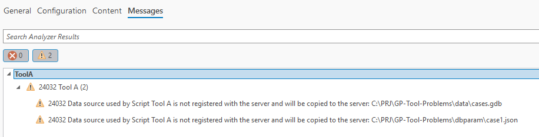

# GP-Tool-Problems
Problems with GP Tools in combination with ArcGIS 11.x

## Description
**Folders**  
data: Folder with databases  
dbparam: Folder with Python Toolboxes and Code  
arcgisinput: Folder with ArcGIS Server input files   
doc: Folder with documentation and images  

**Version**  
ArcGIS Pro 3.4.3  
ArcGIS Enterprise 11.5

## Case 1

##### Test with relative paths.

expected output (PyCharm):
```
Workspace: None
packageWorkspace: C:\Users\milo\AppData\Local\Temp
Path as it is
..\data\sql-cases.sde
..\data\cases.gdb
Relative path converted to absolute path
C:\PRJ\GP-Tool-Problems\data\sql-cases.sde
C:\PRJ\GP-Tool-Problems\data\cases.gdb
```

Output in ArcGIS Pro Toolbox:
```
Workspace: C:\PRJ\GP-Tool-Problems\GP Problems\GP Problems.gdb
packageWorkspace: C:\PRJ\GP-Tool-Problems\dbparam
Path as it is
C:\PRJ\GP-Tool-Problems\GP Problems\..\data\sql-cases.sde
C:\PRJ\GP-Tool-Problems\GP Problems\..\data\cases.gdb
Relative path converted to absolute path
C:\PRJ\GP-Tool-Problems\data\sql-cases.sde
C:\PRJ\GP-Tool-Problems\data\cases.gdb
```
Warning as expected, it should be copied to server.  

Publishing process is successful, but the paths are rewritten on ArcGIS Server.  
rewritten on arcgis server:
```python
import json
import os

import arcpy
# Esri start of added variables
g_ESRI_variable_1 = os.path.join(arcpy.env.packageWorkspace,'sql-cases.sde')
g_ESRI_variable_2 = os.path.join(arcpy.env.packageWorkspace,'..\\cd\\cases.gdb')
g_ESRI_variable_3 = os.path.join(arcpy.env.packageWorkspace,'..\\cd\\dbparam\\case1.json')
# Esri end of added variables

class ToolA(object):
    DEFAULT_CONFIG = {
        "db-sde": g_ESRI_variable_1,
        "db-gdb": g_ESRI_variable_2
    }

    def __init__(self):
        """Define the tool (tool name is the name of the class)."""
        self.label = "Tool A"
        self.description = "Beschreibung von Tool A"
        self.canRunInBackground = False

        config = self._read_configfile()
        self.config = dict(self.DEFAULT_CONFIG)
        self.config.update(config)  # does not work with arcmap

    @staticmethod
    def _read_configfile():
        try:
            configfile = os.path.join(os.path.dirname(os.path.abspath(__file__)), g_ESRI_variable_3)
            with open(configfile, 'r') as f:
                return json.loads(f.read())
        except Exception as e:
            arcpy.AddError('Failed reading config file. {0}'.format(e))
            return e
            
    def execute(self, parameters, messages):
        """The source code of the tool."""
        
        arcpy.AddMessage("Path as it is")
        try:
            arcpy.env.workspace = self.config[arcpy.env.packageWorkspace]
            arcpy.AddMessage(arcpy.env.workspace)
        except Exception as e:
            arcpy.AddError(e)
        try:
            arcpy.env.workspace = self.config[arcpy.env.packageWorkspace]
            arcpy.AddMessage(arcpy.env.workspace)
        except Exception as e:
            arcpy.AddError(e)

        arcpy.AddMessage("Relative path converted to absolute path")
        try:
            arcpy.env.workspace = os.path.abspath(os.path.join(os.path.dirname(os.path.abspath(__file__)), self.config['db-sde']))
            arcpy.AddMessage(arcpy.env.workspace)
        except Exception as e:
            arcpy.AddError(e)
        try:
            arcpy.env.workspace = os.path.abspath(os.path.join(os.path.dirname(os.path.abspath(__file__)), self.config['db-gdb']))
            arcpy.AddMessage(arcpy.env.workspace)
        except Exception as e:
            arcpy.AddError(e)
        return
```

now, to GP Tool doesn't work anymore, because the paths are rewritten on ArcGIS Server.  
The paths are rewritten to absolute paths, which is not what we want.  
The paths should be relative to the package workspace, but they are not.  
This is a bug in ArcGIS Pro 3.4.3 and ArcGIS Enterprise 11.5.  
The expected behavior is that the paths are relative to the package workspace, but they are not.  
The paths are rewritten to absolute paths, which is not what we want.     

REST output:
```
esriJobMessageTypeInformative: Submitted.
esriJobMessageTypeInformative: Executing...
esriJobMessageTypeError: 'D:\\arcgisserver\\directories\\arcgissystem\\arcgisinput\\test\\Case1.GPServer\\extracted\\p30'
esriJobMessageTypeError: 'D:\\arcgisserver\\directories\\arcgissystem\\arcgisinput\\test\\Case1.GPServer\\extracted\\p30'
esriJobMessageTypeError: Failed to execute (Case 1).
esriJobMessageTypeError: Failed.
```

# Case 2

##### Test with absolute paths.   

expected output (PyCharm):
```
Workspace: None
packageWorkspace: C:\Users\milo\AppData\Local\Temp
Path as it is
C:\PRJ\GP-Tool-Problems\data\sql-cases.sde
C:\PRJ\GP-Tool-Problems\data\cases.gdb
Relative path converted to absolute path
C:\PRJ\GP-Tool-Problems\data\sql-cases.sde
C:\PRJ\GP-Tool-Problems\data\cases.gdb
```

Output in ArcGIS Pro Toolbox:
```
Workspace: C:\PRJ\GP-Tool-Problems\GP Problems\GP Problems.gdb
packageWorkspace: C:\PRJ\GP-Tool-Problems\dbparam
Path as it is
C:\PRJ\GP-Tool-Problems\data\sql-cases.sde
C:\PRJ\GP-Tool-Problems\data\cases.gdb
Relative path converted to absolute path
C:\PRJ\GP-Tool-Problems\data\sql-cases.sde
C:\PRJ\GP-Tool-Problems\data\cases.gdb
```

REST output:
```
esriJobMessageTypeInformative: Submitted.
esriJobMessageTypeInformative: Executing...
esriJobMessageTypeError: 'D:\\arcgisserver\\directories\\arcgissystem\\arcgisinput\\test\\Case2.GPServer\\extracted\\p30'
esriJobMessageTypeError: 'D:\\arcgisserver\\directories\\arcgissystem\\arcgisinput\\test\\Case2.GPServer\\extracted\\p30'
esriJobMessageTypeError: Failed to execute (Case 2).
esriJobMessageTypeError: Failed.
```